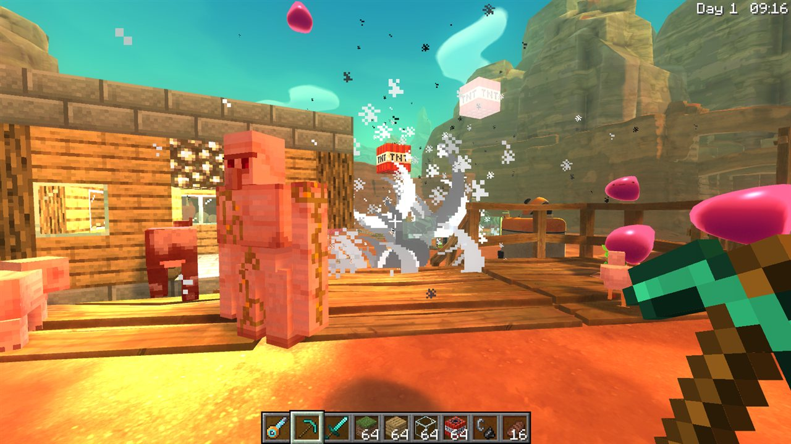
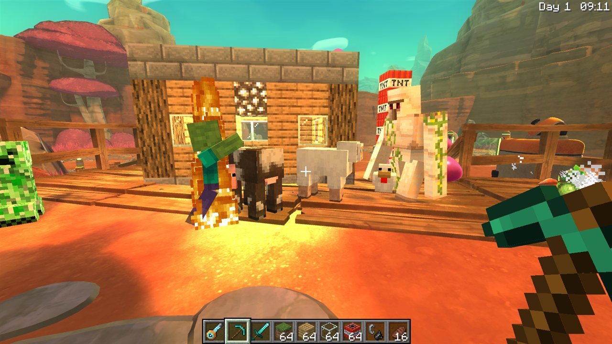
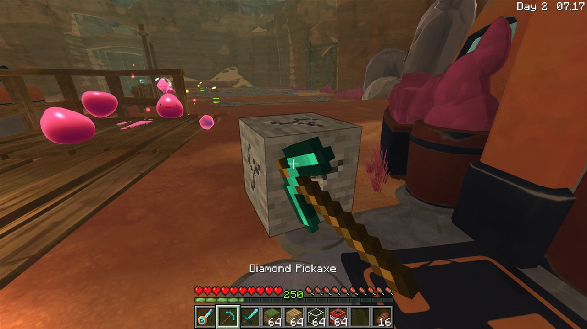
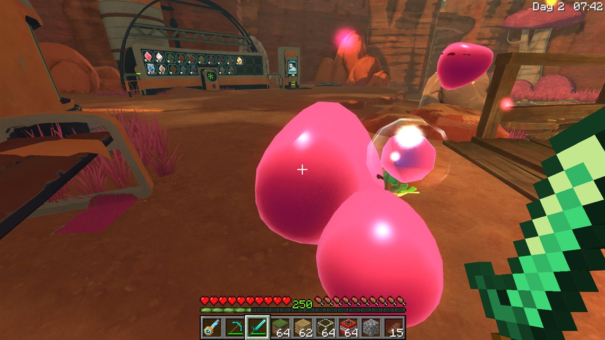
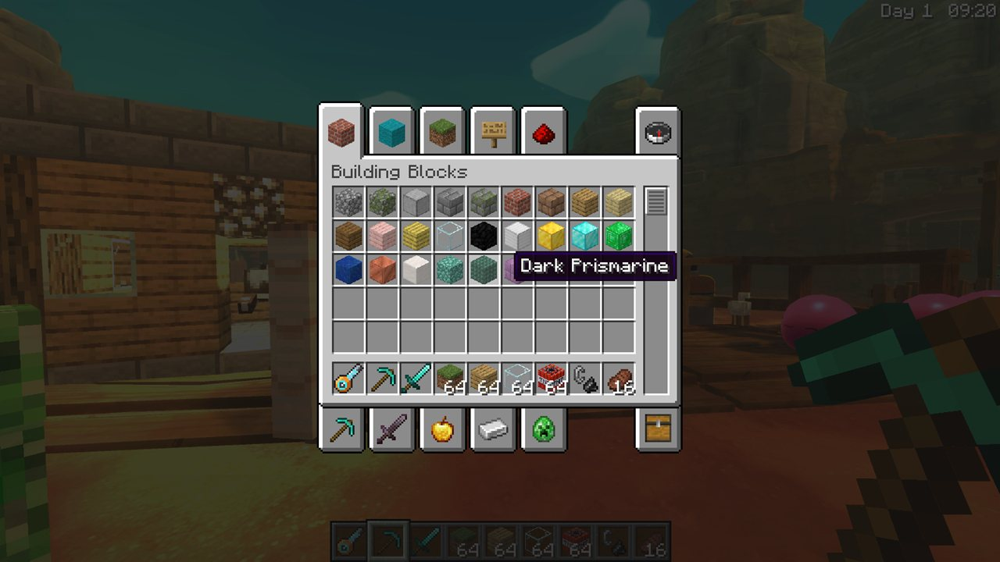

# SlimeCraft — Minecraft inside Slime Rancher

**SlimeCraft** is a free fan mod for **Slime Rancher 1** that puts **Minecraft inside the real Slime Rancher**, in the
spirit of the viral "Minecraft inside Red Dead Redemption 2" videos. You keep the actual Far, Far Range, its slimes,
physics and your vacpack, and Minecraft is layered on top of it.

> **NOT AN OFFICIAL MINECRAFT PRODUCT. NOT APPROVED BY OR ASSOCIATED WITH MOJANG OR MICROSOFT.**
> Not affiliated with, endorsed or sponsored by Monomi Park.
> SlimeCraft contains **no** code, textures, sounds or models from Minecraft or Slime Rancher. Minecraft's assets are
> loaded at runtime from **your own** Minecraft: Java Edition installation, so you need to own both games.



| | |
|---|---|
|  |  |
|  |  |

*Screenshots of the mod running; all Minecraft visuals are loaded from the player's own installation at runtime.*

## Features

* **Minecraft HUD** – hotbar, hearts (your Slime Rancher health), hunger (your energy), XP number (your newbucks),
  crosshair, item names, chat and an F3 debug screen, drawn with Minecraft's textures and bitmap font from your install.
* **Steve's arm** in first person, holding 3D Minecraft items with swing, equip and eating animations. Select the
  vacpack (hotbar slot 1) and Slime Rancher plays exactly as before.
* **Blocks** – about 85 Minecraft blocks you can place on Slime Rancher terrain and mine with the right tools, with
  crack overlay, drops and sounds. Light blocks glow at night, slimes bounce on slime blocks, sand and gravel fall.
* **Mine the Far, Far Range** – hit Slime Rancher rocks, ground and trees with tools to get cobblestone, dirt, sand,
  logs and more (the original world stays intact).
* **TNT** that uses Slime Rancher's own explosion physics – chain reactions send your slimes flying.
* **Minecraft mobs** – creepers, zombies (they burn in daylight), skeletons, pigs, cows, sheep, chickens, Minecraft
  slimes, endermen and iron golems, with natural night spawning outside your ranch.
* **Crossover gameplay** – drop Minecraft carrots, apples or raw meat next to a slime: they turn into Slime Rancher
  food, the slime eats them and makes plorts. Your vacpack sucks Minecraft items straight into your hotbar.
* **Inventory, creative menu and crafting** – recipes are read from your Minecraft install.
* **Commands** – `/give`, `/summon` (including `/summon slimerancher:pink_slime`), `/fill`, `/setblock`, `/time`,
  `/tp`, `/gamemode` and more.
* Your blocks, inventory and animals are saved per Slime Rancher save. Your Slime Rancher save files are never modified.

## Requirements

| What | Notes |
|---|---|
| **Slime Rancher 1** (Steam, Windows) | v1.4.x |
| **Minecraft: Java Edition** (official launcher) | Start version **26.1.2** once from the launcher so its files are in `%APPDATA%\.minecraft`. Other recent releases mostly work (some textures may be missing). For other launchers, set `MinecraftDir` in the config to the instance's `.minecraft` folder. |
| **BepInEx 5** (x64, 5.4.21 or newer 5.4.x) | The mod loader, from the [official BepInEx releases](https://github.com/BepInEx/BepInEx/releases) (`BepInEx_win_x64_5.4.x.zip`). |

## Installation

1. **Install BepInEx 5:** download `BepInEx_win_x64_5.4.23.x.zip` from the
   [official releases page](https://github.com/BepInEx/BepInEx/releases) and extract it into your Slime Rancher
   folder (the one with `SlimeRancher.exe`; in Steam: *right-click Slime Rancher → Manage → Browse local files*).
   Start the game once, then quit.
2. **Install SlimeCraft:** download `SlimeCraft.dll` from the [Releases](../../releases) page and put it in
   `Slime Rancher\BepInEx\plugins\SlimeCraft\` (create the folder).
3. Make sure Minecraft: Java Edition 26.1.2 has been started at least once with the official launcher.
4. Start Slime Rancher from Steam and load or create a save. The first time a save is loaded with SlimeCraft you get
   a starter kit (vacpack, diamond tools, blocks, TNT, flint and steel, food).

The config file is created at `Slime Rancher\BepInEx\config\com.angais.slimecraft.cfg` and the log at
`Slime Rancher\BepInEx\LogOutput.log`.

## Controls

| Action | Default key | Notes |
|---|---|---|
| Select hotbar slot | 1–9 | Slot 1 holds the vacpack. |
| Mouse wheel | | Vacpack selected: cycles vac slots (as in Slime Rancher). Otherwise: hotbar. |
| Attack / mine | Left mouse | With the vacpack: shoot (as in Slime Rancher). |
| Use / place / eat | Right mouse | With the vacpack: vacuum. |
| Inventory | I | Survival inventory with 2×2 crafting; creative menu in creative mode. |
| Chat / commands | Y | Lines starting with `/` are commands. |
| Drop item | Z | |
| Sneak | Left Ctrl | |
| Debug screen | F3 | |
| Switch HUD | F8 | Minecraft HUD ↔ original Slime Rancher HUD. |

Slime Rancher's own keys (WASD, Space, Shift, E, F, R, M, T, Q, Esc…) work as usual. All keys can be changed in the
config file.

## Commands

`/help`, `/give <item> [count]`, `/gamemode <survival|creative>`, `/summon <mob> [x y z]`
(`minecraft:creeper`, `minecraft:pig`, … or `slimerancher:<id>` such as `slimerancher:pink_slime`), `/setblock`,
`/fill`, `/tp`, `/time set <day|noon|night|midnight>`, `/kill`, `/clear`, `/heal`, `/newbucks <amount>`,
`/mobspawning <on|off|ranch on|ranch off|status>`, `/hud <mc|sr|toggle>`,
`/screen <inventory|creative|crafting|chat|none>`.

## Configuration highlights

| Key | Default | Meaning |
|---|---|---|
| `[Core] MinecraftDir` | `%APPDATA%\.minecraft` | Where Minecraft is installed. |
| `[Core] MinecraftVersion` | `auto` | `auto` prefers 26.1.2, otherwise the newest installed release. |
| `[Core] ForceEnglish` | `true` | Shows Slime Rancher's own UI in English while the mod is installed (your saved language is not changed). |
| `[Entities] NaturalSpawning` | `true` | Minecraft mobs spawn naturally. |
| `[Entities] SpawnOnRanch` | `false` | Hostile mobs on your ranch (off by default to protect your slimes). |

Every module has its own section; see the comments in the config file.

## Uninstall

Delete `Slime Rancher\BepInEx\plugins\SlimeCraft\` (and optionally `BepInEx\config\SlimeCraft\` and
`BepInEx\config\com.angais.slimecraft.cfg`). To remove BepInEx too, delete `BepInEx\`, `winhttp.dll`,
`doorstop_config.ini`, `.doorstop_version` and `changelog.txt` from the game folder. Steam's *Verify integrity of
game files* restores a vanilla install.

## Troubleshooting

* **Magenta/black checkerboard textures** – Minecraft wasn't found or the version lacks some files. Start Minecraft
  26.1.2 once from the official launcher, or set `MinecraftDir` / `MinecraftVersion` in the config.
* **Nothing happens** – look for lines with `SlimeCraft` in `BepInEx\LogOutput.log`.
* **Mod conflicts** – SlimeCraft patches Slime Rancher's vacpack input, pause menu and HUD; other mods touching the
  same systems may conflict.

## Building from source

Requirements: Windows, the [.NET SDK](https://dotnet.microsoft.com/download) (6 or newer), Slime Rancher with
BepInEx installed. The build compiles against the DLLs of **your own** installs – Slime Rancher's
`SlimeRancher_Data\Managed\*.dll` and `BepInEx.dll` / `0Harmony.dll` from `<Slime Rancher>\BepInEx\core` (or from a
`lib\BepInEx\` folder you create). None of these files are part of this repository.

```powershell
git clone https://github.com/Angais/SlimeCraft.git
cd SlimeCraft
dotnet build SlimeCraft/SlimeCraft.csproj -c Release
# game in another Steam library:
dotnet build SlimeCraft/SlimeCraft.csproj -c Release -p:SRDir="D:\SteamLibrary\steamapps\common\Slime Rancher"
```

The output is `SlimeCraft/bin/Release/SlimeCraft.dll`. PowerShell helper scripts (all accept `-GameDir <path>`):

| Script | What it does |
|---|---|
| `scripts\build.ps1` | Builds (Release by default) and prints the DLL path. |
| `scripts\install.ps1` | Checks BepInEx and copies the DLL to `BepInEx\plugins\SlimeCraft\` (`-Build` rebuilds first). |
| `scripts\install-bepinex.ps1` | Extracts the official BepInEx zip into the game folder after confirmation (`-Zip <path>` or `-Download`). |
| `scripts\uninstall.ps1` | Removes the plugin (`-RemoveData`, `-RemoveBepInEx` for more). |
| `scripts\run-autotest.ps1` | Automated in-game test (see below). |

### Automated test

`scripts\run-autotest.ps1` backs up your Slime Rancher save folder, starts the game in a window with the test mode
enabled and waits for the report. In test mode the plugin redirects Slime Rancher's saves, profile and settings to a
sandbox folder (and refuses to start otherwise), starts a new game and runs a scripted scenario: HUD, building, TNT,
mobs, every screen, mining, placing, eating, combat, slimes eating Minecraft food, vacuuming Minecraft items and a
save/quit/reload round trip. Screenshots and `report.txt` go to `<Slime Rancher>\BepInEx\SlimeCraft_test\`. Afterwards
the script turns test mode off and verifies that your real save folder is byte-identical to the backup. Details:
[`SlimeCraft/src/Testing/README.md`](SlimeCraft/src/Testing/README.md).

Architecture notes: [`docs/DESIGN.md`](docs/DESIGN.md) and the per-module READMEs under `SlimeCraft/src/<Module>/`.

## Legal

* SlimeCraft's own source code is released under the [MIT License](LICENSE). One file,
  `SlimeCraft/src/Core/Assets/Inflater.cs`, is an altered C# version of `puff.c` by Mark Adler and stays under the
  zlib license – see [THIRD_PARTY_NOTICES.md](THIRD_PARTY_NOTICES.md).
* This repository and its releases contain **no** assets or code from Minecraft or Slime Rancher. Minecraft textures,
  sounds, recipes and language strings are read at runtime from the player's own Minecraft: Java Edition
  installation; Slime Rancher is only modified in memory at runtime through BepInEx and Harmony.
* SlimeCraft is free and will stay free.
* NOT AN OFFICIAL MINECRAFT PRODUCT. NOT APPROVED BY OR ASSOCIATED WITH MOJANG OR MICROSOFT. Minecraft is a trademark
  of Mojang Synergies AB. Slime Rancher is a trademark of Monomi Park; this project is not affiliated with or endorsed
  by Monomi Park. If a rights holder has a concern, please open an issue and it will be addressed promptly.
